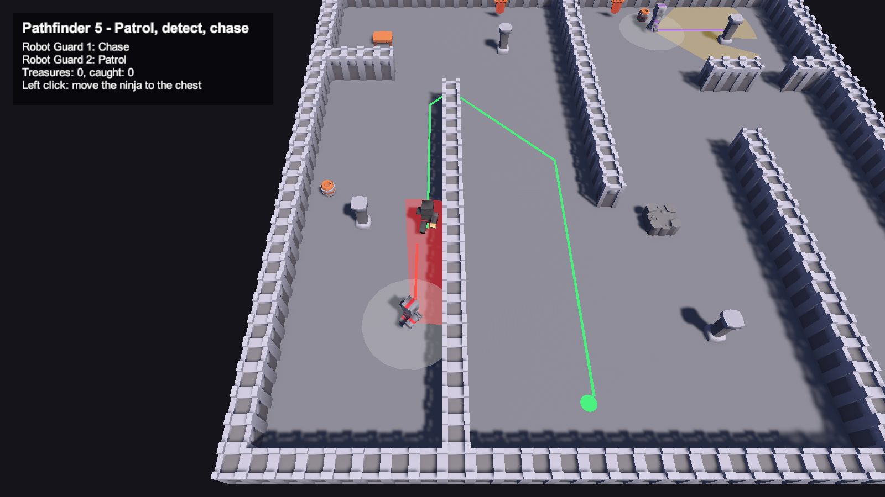
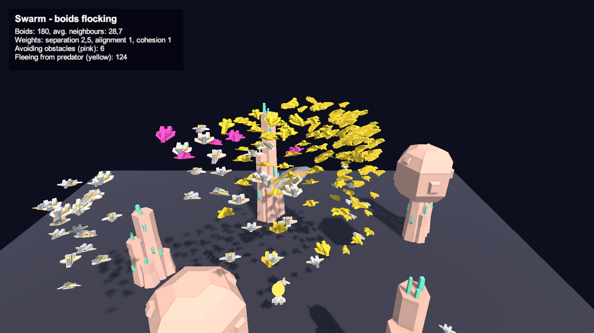
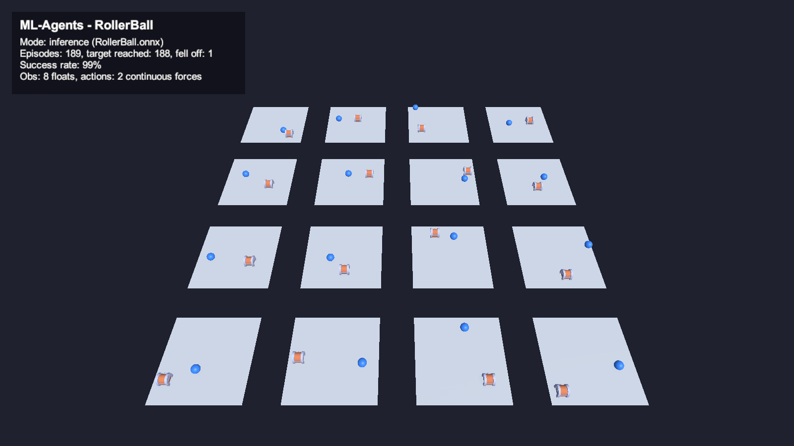

# AI in Games – laboratory

Unity 6 (6000.5, URP) project with the exercises for the *Artificial Intelligence in Games* course:
**Pathfinder 1–5**, **Swarm control** and **Machine Learning** (ML-Agents).
All scenes are generated by editor scripts (menu **AI in Games**) and use free **Kenney CC0** 3D models.

| Scene | Tutorial | Content |
|---|---|---|
| `Assets/Scenes/PathfinderGameplay.unity` | Pathfinder exercises 1–5 | Robot guards patrol, see (field of view) and detect (collider) the ninja player and chase it |
| `Assets/Scenes/Pathfinding.unity` | own A* (steps 1–3) | Node grid, A* search, binary heap optimisation with list/heap benchmark |
| `Assets/Scenes/PathfindingUnits.unity` | own A* (step 4) | Units, path request queue, path simplification, terrain and wall-proximity penalties |
| `Assets/Scenes/Swarm.unity` | Swarm control | Spaceship boids flocking, obstacle avoidance, predator |
| `Assets/Scenes/MLRollerBall.unity` | ML exercises | ML-Agents RollerBall agent, 16 training areas, trained PPO model |

> Keep the Unity window focused while in Play Mode – the editor does not update the game loop
> in the background.

## Pathfinder gameplay (exercises 1–5)



Goal: move the ninja to the treasure chest without being caught. **Left click** moves the ninja. The camera shows the whole map; **Tab** switches to following the ninja, the mouse wheel zooms.

1. **Patrol** – `PatrolPath` + `EnemyAI`: guards walk a loop of points on A* paths (`PathMover`).
2. **Player** – `PlayerController`: click-to-move on A* paths, `ClickPointer` marker, `CameraFollow` (whole-map overview or follow mode).
3. **Point of view** – `PointOfView`: view radius/angle + line-of-sight raycast; the view cone mesh is clipped by walls and turns red when the player is seen.
4. **Detection** – `Detection`: trigger sphere collider around the guard ("hearing"), detects the player even from behind (ring on the floor).
5. **Chase** – `EnemyAI` state machine Patrol → Chase (re-plans A* to the player) → Search (last known position) → Patrol; `GameplayManager` counts treasures and catches.

The pathfinding is an own A* implementation instead of the K-PathFinder package:

- **Grid** (`PathGrid`): the level is split into 0.5 m nodes; nodes overlapping the `Unwalkable` layer are blocked. `GridVisualizer` paints the grid onto the floor.
- **A\*** (`AStarPathfinder`): g/h/f costs, 10/14 grid distance. Orange = explored nodes, blue = path.
- **Heap** (`Heap<T>`): binary min-heap open set, ~1.9× faster than the list version.
- **Units** (`PathRequestManager`, `Unit`, `TargetMover`): queued path requests, simplified waypoints, re-planning, mud and wall-proximity penalties.

## Swarm



- Separation, alignment and cohesion from neighbours in a 3 m radius, plus a weak pull towards a moving target.
- **Obstacle avoidance**: a sphere cast looks ahead; when blocked, 150 golden-spiral directions are tested and
  the ship steers to the first free one. A repulsion from surfaces closer than 1 m keeps ships out of obstacles
  (measured: 7.5 % of boid-frames inside an obstacle without avoidance, 1.1 % with look-ahead only, 0 % now).
- **Colours**: normal ships keep their materials, **pink = avoiding an obstacle**, **yellow = fleeing from the predator ship**.
- All weights are editable on the `Swarm` object (`SwarmManager > Settings`).

## ML-Agents RollerBall



A ball learns to reach a randomly placed treasure chest without falling off the platform
(8 observations, 2 continuous actions, +1 reward). The included model `RollerBall.onnx` was trained with PPO
for 300k steps (mean reward 0.976) and reaches the target in ~98–99 % of episodes.

```
pip install mlagents==1.1.0            # Python 3.10
# Unity: AI in Games > Build RollerBall Training Player
mlagents-learn MLTraining/rollerball.yaml --env Builds/RollerBall/RollerBall.exe --run-id RollerBall --no-graphics
```

Copy `results/RollerBall/RollerBall.onnx` to `Assets/AI/MachineLearning/Models/` and rebuild the scene
(`AI in Games > Build ML RollerBall Scene`). For manual control set *Behavior Type* to *Heuristic Only* and use WASD.

## 3D models

Free models by [Kenney](https://kenney.nl), licence **CC0** (licence files in `Assets/ThirdParty/Kenney`):
Blocky Characters (ninja, robots, units – animated), Mini Dungeon (walls, floor, props, chest),
Space Kit (ships, crystal rocks, meteors). `AI in Games > Setup Kenney Models` prepares the rigs and
the locomotion Animator Controller.

## Project layout

| Path | Content |
|---|---|
| `Assets/AI/Pathfinding/Gameplay` | Pathfinder exercises 1–5 |
| `Assets/AI/Pathfinding/Scripts` | Own A* implementation |
| `Assets/AI/Swarm/Scripts` | Swarm scripts |
| `Assets/AI/MachineLearning` | ML-Agents agent, stats and trained model |
| `Assets/AI/Editor` | Scene builders, Kenney model setup, screenshot helper |
| `Assets/ThirdParty/Kenney` | CC0 3D models |
| `MLTraining` | PPO config and exported reward curve |
| `Docs/img` | Screenshots used in the report |
